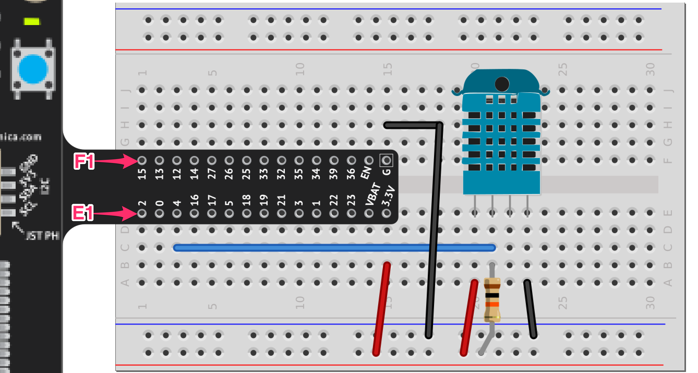

03 - Adding Sensors
==============

Add a Temperature and Humidity Sensor
--------------------- 
Locate the small bag of components included with your IoTanium DevKit.  **Note: the jumper wire colors in your DevKit may not match the colors in the diagrams below.  You can use any color wire to make any connection, the wire color is not important.**  Follow the steps below to add a DHT-11 temperature and humidity sensor to your project:

- The lower portion of your IoTanium hardware is a breadboard adapter.  In order for the lab wiring diagrams to work as expected, your breadboard adapter must be oriented correctly on the breadboard.  To do so, **ensure that pin 2 on the breadboard adapter is inserted in hole E1 on the breadboard, and pin 15 on the breadboard adapter is inserted in hole F1 on the breadboard (see diagram below).**
- Locate the blue DHT-11 sensor, and turn it so the holes are facing you.  Insert the four wires into holes E20 - E23 on the breadboard.
- Locate a 10K ohm resistor.  It will be light brown with brown, black, orange, and gold bands.  Connect one end to hole B21, and the other end to any free hole on the red (+) rail on the breadboard.  This is a 'pullup' resistor that will make the DHT11 readings more reliable.
- With jumper wires, make the following connections:
   - A20 to any free hole on the red (+) rail.  This provides power to the DHT11.
   - C21 to C3.  This connects the 'data' pin on the DHT 11 to the input pin 4 on the IoTanium.
   - A23 to any free hole on the black (-) rail.  This provides ground to the DHT11.

- Before continuing, inspect and double check the wiring above, to avoid potentially damaging or destroying your IoTanium developer board.
- When you are confident your wiring is correct, use jumper wires to connect power and ground from your circuit to the dev board:
   - B15 to any free hole on the red (+) rail.
   - H15 to any free hole on the black (-) rail.

Your finished circuit should look like the image below, note that the third pin on the DHT-11 is not used:

Back in your WebREPL session, run the following commands to interact with the DHT-11 sensor::

    >>> import machine
    >>> import dht
    >>> d = dht.DHT11(machine.Pin(4))
    >>> d.measure()
    >>> d.temperature()
    21
    >>> d.humidity()
    51
    >>> 

Note that ``d.measure()`` reads the values from the sensor. ``d.temperature()`` and ``d.humidity()`` only `hold` the values, and only update when ``d.measure()`` is run again.  

Experiment with changing the temperature and/or humidity reading of the sensor, and taking more readings to show the change.  You can do this by placing the unit in direct sunlight, breathing warm air on the sensor, etc.

Add a Light Sensor
--------------------- 