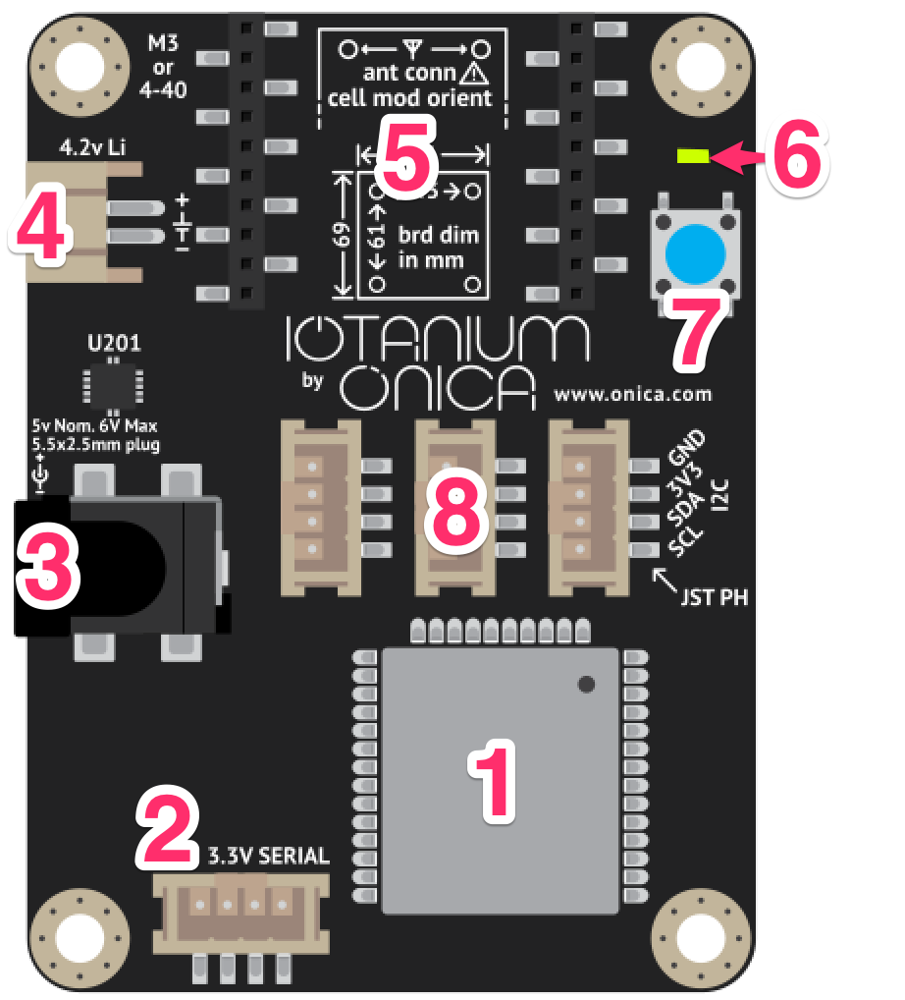
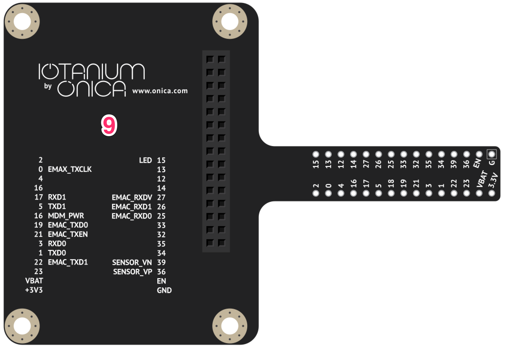

03 - IoTanium Feature Tour
==============

ESP32 Features
~~~~~~~~~~~~~~~~~~~~~~~~~~~~~~~~
Your IoTanium Development board is built around the powerful Esspresif ESP32 Microcontroller Unit (MCU).  The ESP32 chip is small and affordable, with features that are perfectly suited for a broad range of IoT applications. The ESP32 is equipped with GPIO pins, and includes support for a variety of protocols like SPI, I2C, UART, and more. One key feature of the ESP32 is that both wireless networking and Bluetooth are included onboard the MCU itself.  This sets the ESP apart from other microcontrollers like those found on boards like Arduino and Rasberry Pi, for which WiFi and Bluetooth require additional onboard components, or add on hardware. This means that you can easily control and monitor an ESP32 based devices remotely without the need for additional WiFi or Bluetooth components.

.. image:: ../img/esp32-chip.png
    :align: center
    :alt: ../img/esp32-chip.png
    :width: 200px

**Features of the ESP32 MCU:**

- Xtensa Dual-Core 32-bit LX6 with 600 DMIPS @160 MHz
- 802.11 b/g/n Wi-Fi
- Bluetooth 4.2 and BLE
- SRAM and Flash capable
- 36 GPIO pins
- 16 software PWM channels
- Common protocol interfaces: 4 SPI, 2 I2C, 2 I2S, 2 UART
- 12-Bit Analog to Digital Converter (ADC)
- Controller Area Network (CAN) enabled
- Ethernet MAC interface
- Onboard sensors
   - Capacative touch
   - Temperature
   - Hall effect
- Operating temp range: -40ºC to 125ºC

----

IoTanium Features
~~~~~~~~~~~~~~~~~~~~~~~~~~~~~~~~
The IoTanium Development board expands on the capabilities of the ESP32 chip, by providing additional hardware common to many enterprise IoT development projects.  Below is a diagram of the IoTanium board and its components:

1. ESP32 MCU
2. 3.3V Serial JST connector
3. Barrel jack power connector
4. External battery connector, and onboard charger
5. LTE Cell modem ready
6. STATUS LED
7. Button
8. 3 JST connectors, wired for I2C
9. 30-pin breakout board/breadboard adapter, with pinout diagram
10. Micro-USB port, which provides USB to serial and can power the board (not shown)

----

Convenience Functions
~~~~~~~~~~~~~~~~~~~~~~~~~~~~~~~~
Your IoTanium board includes a number of convenience functions, which are baked into the ``iotanium`` module of the Micropython firmware.  These functions allow you to easily interact with the sensors of the ESP32, as well as some hardware features of the board.  In this section, we will walk through the convenience functions that are available.  

This section assumes you have:

- A working IoTanium Developer Kit
- Succesfully completed the setup process for your device in section :doc:`../setup/setup`, and you are currently connected to your device via your WiFi and WebREPL session.

Below are descriptions of the the available convenience functions:

- ``iotanium.led('on')`` - turns the STATUS LED on
- ``iotanium.led('off')`` - turns the STATUS LED off
- ``iotanium.blink(delay_ms, duration_sec)`` - blinks the STATUS LED with a delay in ms and duration in seconds
- ``iotanium.hall()`` - reads the value of the onboard hall effect sensor, which can be used to measure magnetic fields near the ESP32 chip.
- ``iotanium.temp()`` - reads the value of the onboard temperature sensor.
- ``iotanium.touch()`` - reads the value of an onboard capacitive touch sensor, mapped to PIN12 on the IoTanium board.
- ``iotanium.read_all()`` - reads all onboard sensor values above, and returns them in JSON format.

The following functions are also included, but are not used in this walkthrough, and should only be used by users who are comfortable with their operation:

- ``iotanium.setup()`` - connects to WiFi networks configured in ``iotanium_cfg.json``.  If no config is present, or all WiFi connections fail, will automatically enable the Access Point for troubleshooting.
- ``iotanium.connect_sta_if()`` - connects to WiFi networks configured in ``iotanium_cfg.json``, but does not enable the AP on failure or missing config.
- ``iotanium.enable_ap_if()`` - enables the Access Point interface, regardless of the state of the WiFi interface.  Access point info: Network Name: ``IoTanium-######`` (where ###### is the MAC address of the device), IP address: ``192.168.4.1``, Password: ``iotanium``

Safe Mode Boot
~~~~~~~~~~~~~~~~~~~~~~~~~~~~~~~~
While unlikely, there are some failure modes that could make it difficult for a user to connect to thier board to troubleshoot.  Some of these scenarios include, but are not limited to:

- Running code that spawn resource intensive `tight loops`, that cause the WebREPL to be slow or unresponsive.

- Automatic execution of `main.py`, without a successful connection to WiFi or enabling the WebREPL.  This is a default behavior of Micropython, that will be covered in a later section.

- Automatic execution of code from ``boot.py``, without a successful connection to WiFi or enabling the WebREPL.   

- Successful connection to a WiFi network, to which the user can no longer access.

To mitigate these and other possible scenarios, your IoTanium board supports a **safe mode boot** option.  Booting into safe mode will:

- skip the automatic execution of any code (including ``main.py``, and code called from ``boot.py``)
- skip attempting to connect to WiFi
- enable the Access Point and WebRREPL only

In this state, a user can easily connect to the Access Point WiFi network, and troubleshoot the device using the WebREPL, without interference caused by background code. To enter safe mode boot, follow the steps below:

1. Power off the device by unplugging the micro usb cable.
2. Press **and hold** the blue button on the device.
3. While continuing to hold the button, power on the device by plugging the micro usb cable back into the device.
4. Carefully watch the STATUS LED, located above the button.
5. When the LED blinks rapidly for 5 seconds, your device has entered **safe boot mode**
6. Release the button
7. Connect to the device AP and WebREPL using the same steps described in section :doc:`../setup/setup`.

